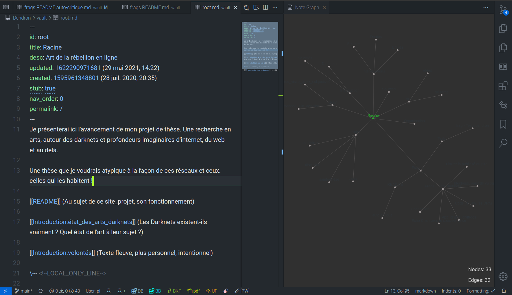

**Mise en place d'un système de notes par fiches avec Dendron**   

Messages mix dédié à l'interface web + git <!--LOCAL_ONLY_LINE-->

---

### Consulter les pages    
[https://bonnebulle.github.io/dendron/](https://bonnebulle.github.io/dendron/) (racine du site_projet)    
[https://bonnebulle.github.io/dendron/notes/README.html](https://bonnebulle.github.io/dendron/notes/README.html)    
(cette note_page mise en forme en html)     

### Consulter les sources
[Projet sur Github](https://github.com/bonnebulle/dendron)   
[Dernières mises-à-jour](https://github.com/bonnebulle/dendron/commits/main)    
( "arrivages" ou "*Commits*"  [ jargon sur [Wikipédia](https://fr.wikipedia.org/wiki/Commit) ] )

---

Dans les pages_notes les indications internes relatives au fonctionnement de Dendron, de ce site et de son architecture sont indiquées de la sorte :
>>>>>> Indication dédiée au site ou notes internes.

---

## Les motivations : /// la recherche des bons moyens
Je cherchais un outil_moyen de prises de notes et de développement de ma pensée par écrit. Je voulais éviter les outils numérique d'écriture dont les interface graphiques et la mise en page est souvent trop éloignée du rendu final. Je me suis mis en recherche d'une solution de mise en forme et publication de mon travail dans un interface que je puisse augmenter.

> La philosophie de cette outil sans base de donnée, en text-brut, décentralisé, est celui de l'*Open Access*. Une modalité de création de contenus pensés pour rester accessibles plutôt qu'encapsulés, enfermés dans des couches logiciels.

---

##### Note technique, dépendance, production
J'ai donc fait une [étude de marché (et recherches)](https://liens.vincent-bonnefille.fr/?AGBhmA) au sujet des systèmes_outils de prise de notes élargies. J'ai retenu **Dendron** comme solution  *open-source* déjà largement employée dans la recherche universitaire {( reposant sur un éditeur de texte penser pour le code (vsCode de *Microsoft* cf. [vsCodium](https://vscodium.com/)) )}. 

Côté serveur, Dendron se produit avec node.js ce qui rend sa mise en ligne assez souple (mais complexifie aussi la distribution des contenus régulés par Express).

---

#### Remonter le fil de sa pensée 
Par le passé j'avais déjà essayé de retranscrire mon système personnel de prise de notes arborescentes (indentées par marges successives en fonction d'un éloignement du sujet central (tronc de la pensée dispersée)). 

[Un exemple par ici](https://vincent-bonnefille.fr/index/about/read_more/).     
     
>> Mais mes années d'écriture (thérapeutique ou de recherche) se sont éparpillées entre plusieurs ordinateurs-supports. Dendron semble offrir une pseudo-centralité qui pourrait m'aider à faire le tri, à intentionaliser ces moments d'adresse variables. De lier, de mettre de côté sans jetter trop vite.     
On retrouve {ici} cette déconcentration (ou hors-propos, doute, chemin de traversse) par ce jeu de couleurs graduelle (et encore mal assumé).    
>>>> Je doute donc je suis.

## Dendron : notes par branches
Comme le rappelle la [page de présentation](https://wiki.dendron.so/notes/05774b2e-ebf7-4bbc-8171-ad191ba0ae0a.html) de cet outil et projet, Dendron tire son nom de cet imaginaire végétal : 
"*Les dendrites (du grec δένδρον déndron «arbre») sont des prolongements du corps cellulaire des neurones dont elles partagent les organites*",
en citant ici [Wikipédia fr](https://fr.wikipedia.org/wiki/Dendrite_(biologie)).

----

Dendron permet la création notes_pages sous-partimentées, sous la forme d'une arboréscence fragmentée en fiches_pages_notes. Ce système d'organisation par fiches par catégories et liens prend le nom de son inventeur : **Zettelkasten** ($source).

Pour en savoir plus je conseille cet article en français autour de la prise de note : [https://organisologie.com/prise-de-note/](https://organisologie.com/prise-de-note/).

Et [celui-ci (en français)](https://www.arthurperret.fr/visualisation-documentation-personnelle-reticulaire.html) :
> "Il s’agit d’une pratique de la fiche érudite. adossée à un système de liens internes et d’indexation par mots-clés."

### Auto-critique
[[frags.README.auto-critique]]

### Organisation des dossiers
#### Parents-enfants : sous-ensembles
Placées dans des (sous-)dossiers à la *racine* du projet_site ces notes_pages respectent cette "descendance" : un dossier *parent* encapsule-contient-rassemble des *enfants* (fichiers) sur le même sujet). **Ces *enfants* sont eux traîtés come des sous-parties ou continuité de la thèse : ces pages_notes développent *en détail* la question plus générale, parente, générale, d'ensemble.**
>>>>>> J'ai renommé les *enfants* (*Childrens*) en "**Sous parties**" affichées en bas de page_notes.

#### Navigation / interface
Une arboréscence retranscrite sous la forme d'un menu de navigation vertical et horizontal (fil d'Ariane). Cela permet à l'usager ou usagère de facilement se situer dans quel partie il.elle se trouve.  Les pages_notes descendantes (à l'intérieur du même dossier parent), se succèdent selon cette logique à la suite l'une de l'autre.

##### Liens (de retour) ou *Backlinks* entre les pages
Les pages_notes enfants, du même dossier parent sont mentionnées en bas de page (lien cliquable). Les liens internes entre les notes_pages produisent automatiquement des liens de référence entre elles (également présentés en pied de page). 
> Ce maillage devrait aider à produire et maintenir des liens verticaux, des voisinages de pensés. 
>> Les *Tags* ("*étiquettes*") servent aussi à lier les contenus se rapportant au même sujets (les pages_notes avec un même tag_label s'affichent en bas de page cf. *backlinks*).
>>> Une prise de note qui me rapproche d'une création web, étoilée.

### Construit localement, publié facilement
Dendron me permet de de mettre facilement mon travail de recherche en ligne { sur une page web construite sans #base-de-données externe (ce qui accélère le chargement et rend l'intégralité des notes accessibles en brut (fichiers eux-même, *markdown*)). Le tout est orienté *local*, c'est à dire que je garde la main sur mes fichiers qui ne sont pas édités directement en ligne, autrement dit sur un *cloud*. }

#### Markdown, mise en page simplifiée
L'écriture de ces pages se fait sans coder, sans le superflu d'un interface de mise en forme parfois encombrant sur nos éditeurs de texte traditionnels. Une mise en page simplifiée à l'aide du langage de balisage ***markdown*** ([wiki Dendron](https://wiki.dendron.so/notes/ba97866b-889f-4ac6-86e7-bb2d97f6e376.html)).

##### Métadonnées, en tête
Les fichiers en *texte brut* sont lisible par un simple éditeur de text. Dendron y accole des **métadonnées** : un identifiant unique permettant la création de **liens uniques** (*hash*), les dates de création et de mise à jour, une description, etc. 

{ Ces informations-paramètres sont inscrits dans l'en-tête du fichier qu'on appelle *[frontmatter](https://wiki.dendron.so/notes/ffec2853-c0e0-4165-a368-339db12c8e4b.html)* (*"matière en tête"*) ou dans un fichier .yml distinct. }

#### Sauvegardes, suivi de versions avec git
Les sauvegardes de mes fichiers s'effectuent avec le *système de versioning* **Git** qui offre de nombreux avantages à commencer par la description détaillée des points de sauvegarde / d'avancement du projet. Ce système utilisé dans l'écriture de logiciels informatiques offre un suivi transparent sur les différentes modifications apportées (au sein des fichiers textes dont les différences sont facilement comparables)

[Dernières mises-à-jour / *commit*](https://github.com/bonnebulle/dendron/commits/main) 

## Résumé des avantages
Ainsi je peux facilement faire demi-tour dans mon écriture ; envoyer mes données sur cette plateforme qui les produit-publie en ligne ; **je garde la main sur ces données** ; et l'éditeur que j'utilise correspond à mes exigences en matière d'interface à la fois léger et complet (avec des outils comme une *mini-map*, l'ajout de **liens internes**, la visualisation graphique des ramifications entre les contenus, *liens de retour*/"*Backlinks*" entre les notes citées entre elles, etc).

## À venir ( reste à faire )

DONE:::
+ Export md > **pdf et fichier text traditionnel** 
> ( type .doc / .odt (bien que des extensions sur *VSCode* ou *Codium* soient en capacité d'ouvrir les *markdown* en .md avec un interface utilisateur du genre *LibreOffice* / *Microsoft Office*). J'ai déjà trouvé les outils nécessaires :   [étude de marché (et autres ressources)](https://liens.vincent-bonnefille.fr/?AGBhmA).
J'ai opté pour le momet pour une pseudo-automatisation de conversion des pages_notes en #markdown vers du html puis en pdf avec #pandoc . Une fois généré le pdf est mis dans un dossier. Il est accessible depuis le web au niveau du fil d'ariane 
( ajout côté front-end TODO - intégrer au template généré en liquid)
> J'ai trouvé un juste milieu en métant les notes de bas de page #ndbp sur le côté droit des pdf avec la mise en page [#tufte](https://liens.vincent-bonnefille.fr/?&searchtags=tufte+#9L_Imw). La génération de pdf n'est pas parfaite mais suffisante pour le moment.
>> TODO : Les liens entre ls pdf n'est pas clair. Les liens entre crochets indiquent la référence_dendron du fichier et non son nom / id (retenu pour le moment)
>>> une prise de notes sur le côté ( #tufte ) plutôt qu'en scroll en bas de page. Bien repensé-étudié dans [cet article](https://www.arthurperret.fr/semantique-et-mise-en-forme.html).

TODO::
+ Ajout d'une *mini-map* (front-end)
> https://larsjung.de/pagemap/

DONE:::
+ Correction automatique des espaces insécables devant les [ : ; ? ! () etc ] ( en js côté front-end dans un premier temps) + /// breakline br

DONE:::
+ Thème_design clair / { foncé (actuel) } 🌒 
> <https://pmarsceill.github.io/just-the-docs/docs/customization/>

### Travail en cours de formation
NB: cette démarche est aussi celle d'un auto-apprentissage tant méthodologique (*Zettelkasten*) que technique (*Github*) que je maîtrise partiellement. 
>>> À ce sujet, le créateur de Dendron dit sur son site ([principes](https://wiki.dendron.so/notes/7fcebd7d-6411-4c9d-8baf-65629dc018a1.html)) qu'il est **facile à prendre en main difficile à maîtriser** ("*Easy to learn, hard to master*") en faisant référence à "La loi de Bushnell ou loi de Nolan" (théorie des jeux) [wikipédia (fr)](https://fr.wikipedia.org/wiki/Loi_de_Bushnell). 

----

#### Articles de référence :
**Une alternative à Word : écrire en RMarkdown**
https://data.hypotheses.org/1144
Par Alexandre Hobeika, le 25/02/2017
Docteur en sociologie politique de l'EHESS, CMH-ETT 
( écrit avec Florent Bédécarrats ) 

Dennis Tenen et Grant Wythoff, «**Rédaction durable avec Pandoc et Markdown**» traduction par Marie-Christine Boucher, *The Programming Historian* en français 2 (2020), https://doi.org/10.46430/phfr0013.
https://programminghistorian.org/fr/lecons/redaction-durable-avec-pandoc-et-markdown

...

Pour en savoir plus je conseille cet article en français autour de la prise de note : [https://organisologie.com/prise-de-note/](https://organisologie.com/prise-de-note/).

Et [celui-ci (en français)](https://www.arthurperret.fr/visualisation-documentation-personnelle-reticulaire.html) :
(( site de référence sur la mise en page avec pandoc / LaTeX ))
https://www.arthurperret.fr/semantique-et-mise-en-forme.html au sujet de #tufte (notes manuscrites en marges de la page).

...

D'autres liens 'en vrac', sur mon log / blog, au fil de mes recherches sur cet outil ( liens_bulles [#dendron](https://liens.vincent-bonnefille.fr/?searchterm=&searchtags=dendron) )